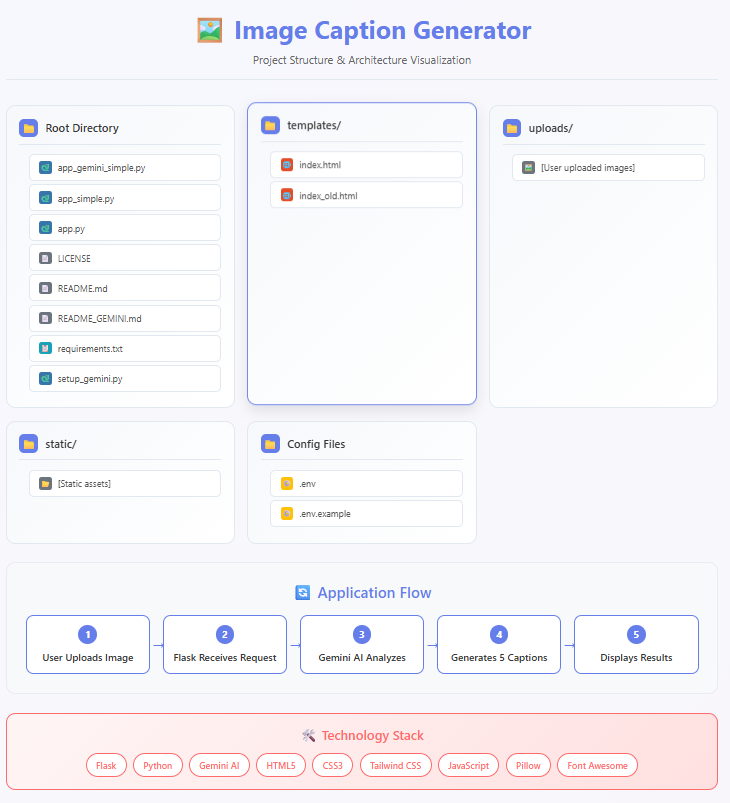
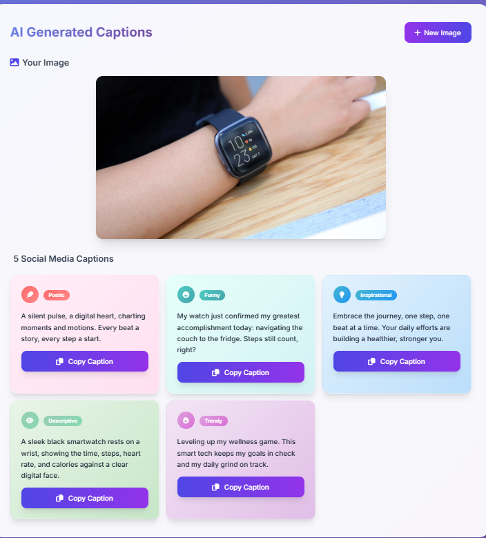

# Image Caption Generator with Gemini AI

A modern web application that uses Google's Gemini AI to generate 5 different social media captions for uploaded images. Built with Flask backend and beautiful HTML/CSS/JavaScript frontend.

**Author**: Pritam Chakrabortty

## Features

- **🖼️ Image Upload**: Drag-and-drop or click to upload images
- **🤖 AI Captioning**: Uses Google Gemini 2.5 Flash model for accurate image descriptions
- **🎨 Modern UI**: Beautiful gradient design with glass morphism effects
- **📝 5 Caption Types**: Poetic, Funny, Inspirational, Descriptive, Trendy
- **📋 Individual Copy**: Each caption has its own copy button
- **📱 Responsive Design**: Works perfectly on all devices
- **⚡ Fast Processing**: Quick AI analysis and caption generation
- **🔒 Secure**: Local processing with API key protection

## UI Screenshots & Graphical Representation




### Project Structure Visualization
For a complete graphical representation of the project structure, see `project_structure.html` in the project directory.

## Technology Stack

- **Backend**: Flask (Python)
- **AI Model**: Google Gemini 2.5 Flash
- **Frontend**: HTML5, CSS3, JavaScript, Tailwind CSS
- **Image Processing**: Pillow (PIL)
- **API Integration**: Google Generative AI
- **Icons**: Font Awesome
- **Typography**: Inter Font

## Installation

### Prerequisites

- Python 3.8 or higher
- Google Gemini API key
- pip package manager

### Step 1: Get Gemini API Key

1. Visit [Google AI Studio](https://aistudio.google.com/app/apikey)
2. Sign in with your Google account
3. Click "Create API Key"
4. Copy your API key

### Step 2: Configure API Key

**Option A: Environment Variable (Recommended)**
```bash
# Windows
set GEMINI_API_KEY=your_actual_api_key_here

# Linux/Mac
export GEMINI_API_KEY=your_actual_api_key_here
```

**Option B: Edit .env file**
1. Copy `.env.example` to `.env`
2. Edit `.env` and replace `YOUR_API_KEY_HERE` with your actual API key

### Step 3: Install Dependencies

```bash
pip install -r requirements.txt
```

### Step 4: Run Application

```bash
python app_gemini_simple.py
```

### Step 5: Access Application

Open your browser and navigate to:
```
http://localhost:5000
```

## Usage

1. **Upload Image**: Drag and drop an image onto the upload area or click to browse
2. **AI Processing**: Wait for Gemini AI to analyze the image
3. **View Captions**: See 5 different social media captions in color-coded boxes
4. **Copy Caption**: Click the copy button for any caption you like
5. **New Image**: Upload another image for more captions

## Caption Types

The application generates 5 different types of captions:

1. **🪶 Poetic**: Artistic and expressive captions
2. **😄 Funny**: Humorous and entertaining captions
3. **💡 Inspirational**: Motivational and uplifting captions
4. **👁️ Descriptive**: Clear and informative captions
5. **🔥 Trendy**: Modern and social media friendly captions

## File Structure

```
IMAGE CAPTION GENERATOR/
├── app_gemini_simple.py    # Main Flask application with Gemini integration
├── app_simple.py          # Mock captioning version
├── app.py                 # Original BLIP model version
├── requirements.txt         # Python dependencies
├── README.md              # This file
├── LICENSE                 # MIT License
├── .env.example           # Environment template
├── .env                   # Your API key (create from .env.example)
├── project_structure.html  # Project structure visualization
├── templates/
│   ├── index.html         # Main frontend with modern UI
│   └── index_old.html     # Backup of previous version
├── uploads/               # Directory for uploaded images (auto-created)
└── static/                # Static files directory (auto-created)
```

## API Endpoints

- `GET /` - Main page with upload interface
- `POST /upload` - Upload image and generate 5 captions
- `GET /static/uploads/<filename>` - Serve uploaded images
- `GET /health` - Health check endpoint

## Supported Image Formats

- PNG
- JPG/JPEG
- GIF
- BMP
- TIFF
- WebP

## Configuration

- **Maximum file size**: 16MB
- **Host**: 127.0.0.1 (localhost)
- **Port**: 5000
- **AI Model**: Gemini 2.5 Flash

## API Usage & Limits

- Gemini API offers generous free tier
- Free tier includes 1,500 requests per day
- Check [Google AI Pricing](https://ai.google.dev/pricing) for current limits
- Each image upload generates 5 captions (counts as 1 API request)

## Troubleshooting

### Common Issues

1. **"Gemini API not configured" error**
   - Ensure your API key is set correctly
   - Check that `.env` file exists and contains your key
   - Verify API key is valid and active

2. **API rate limit exceeded**
   - Wait a few minutes and try again
   - Consider upgrading to a paid plan for higher limits

3. **Invalid API key**
   - Verify your API key is correct
   - Ensure it hasn't expired

4. **Network connectivity issues**
   - Check your internet connection
   - Verify firewall allows API access

### Debug Mode

The application runs in debug mode by default. Check console output for detailed error messages.

## Performance Notes

- First image processing may be slightly slower due to model initialization
- Subsequent processing will be faster
- Caption generation typically takes 2-5 seconds
- Images are stored locally and deleted when server restarts

## Security Notes

- Never commit your `.env` file to version control
- Use environment variables in production
- Application runs on localhost by default for security
- API keys are not logged or exposed

## Advanced Features

### Custom Caption Prompts
You can modify the caption generation prompt in `app_gemini_simple.py`:

```python
response = model.generate_content([
    "Generate exactly 5 social media captions for this image. Each caption should be Instagram-worthy (maximum 25 words). Include variety: one poetic, one funny, one inspirational, one descriptive, and one trendy. Format: 1. [poetic caption] 2. [funny caption] 3. [inspirational caption] 4. [descriptive caption] 5. [trendy caption]. No extra text.",
    image
])
```

### Model Selection
Change the model by modifying the model initialization:

```python
model = genai.GenerativeModel('gemini-2.5-flash')  # Current
# model = genai.GenerativeModel('gemini-1.5-pro')  # More powerful
```

## Contributing

1. Fork the repository
2. Create a feature branch
3. Make your changes
4. Test thoroughly
5. Submit a pull request

## License

This project is licensed under the MIT License - see the [LICENSE](LICENSE) file for details.

## Third-Party Licenses

- Flask: BSD 3-Clause License
- Google Generative AI: Apache 2.0 License
- Pillow: HPND License
- Tailwind CSS: MIT License
- Font Awesome: CC BY 4.0 License
- Inter Font: SIL Open Font License 1.1

## Support

For issues and questions:
1. Check the troubleshooting section above
2. Review console error messages
3. Verify API key configuration
4. Test with different image formats

---

**🚀 Transform your visual stories with AI-powered captions!**
